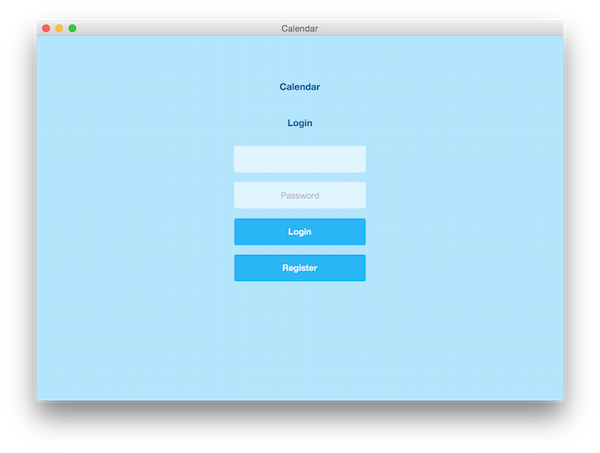
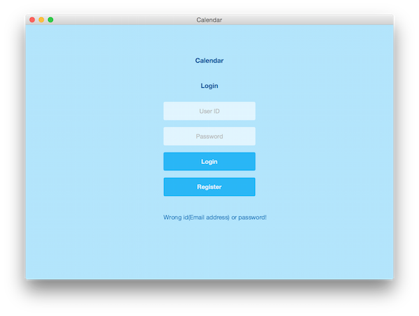
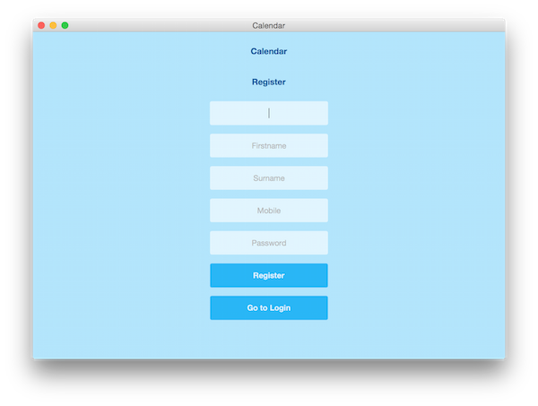
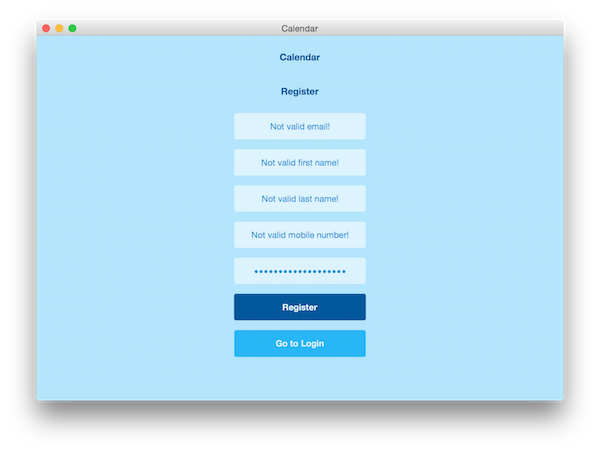
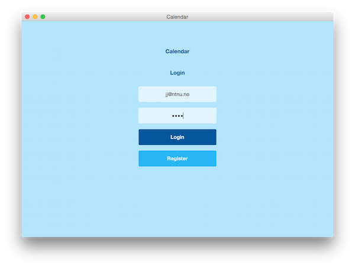
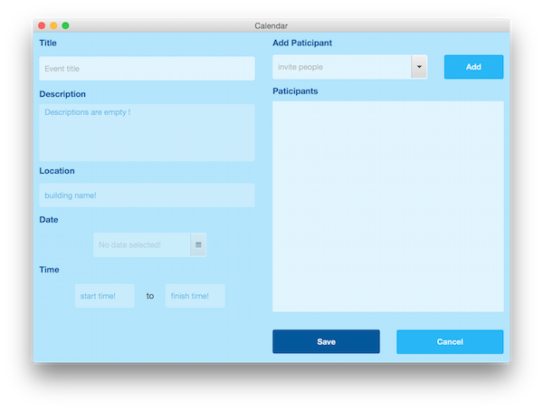
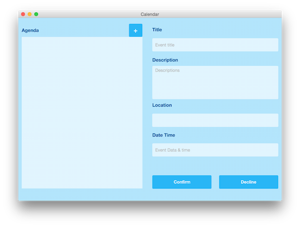

Calendar Program
==

Building tools:

JavaFX, FXML, CSS and JavaFX Scene Builder

IDE:

IntelliJ

Database: MySQL: ntnu.student mysql database

Screenshot
--

Light Blue theme design.

Login feedback message.

Register screen

fade in and out animate validation messages!
- attract attentions for the invalid inputs.

Login with an account.

validate messages shows at the wrong input place!
- easy to find out and edit the input error.

View screen

Other Information
--
use [Color palette Color to Designer](http://www.google.com/design/spec/style/color.html#color-color-palette)

- to design colors.