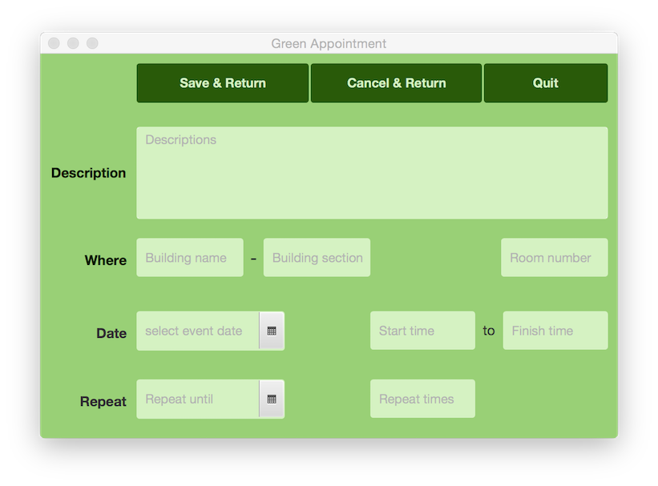
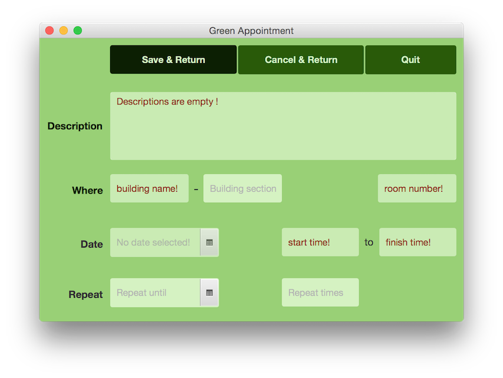
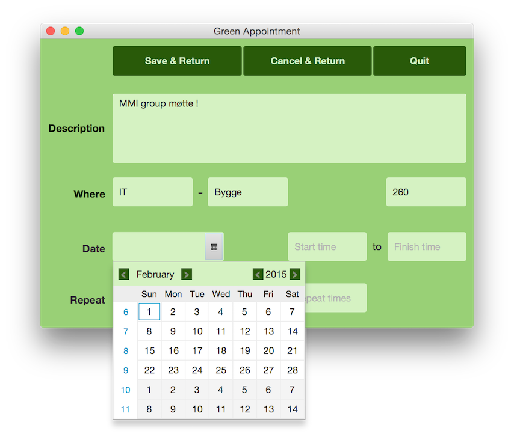
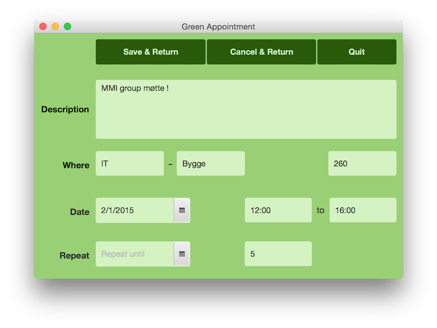
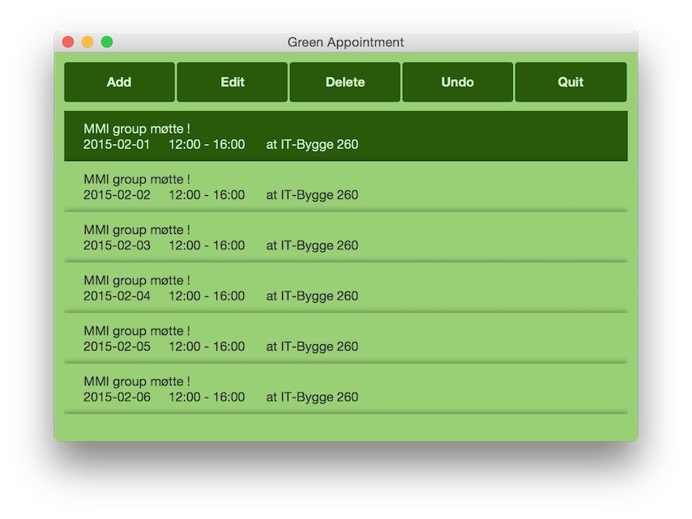
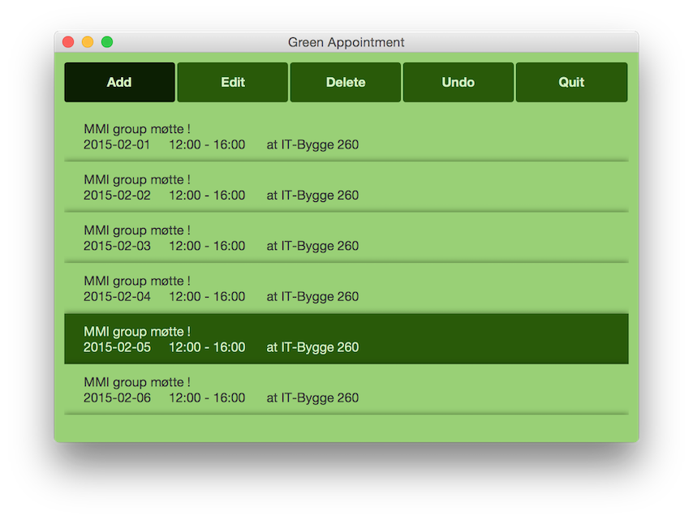
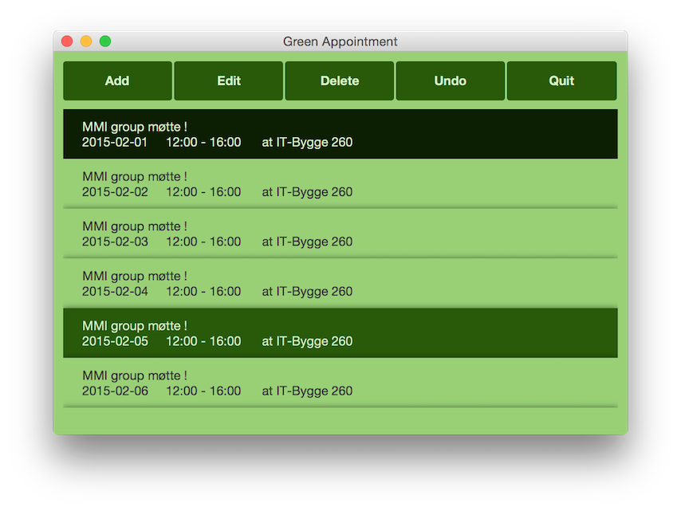
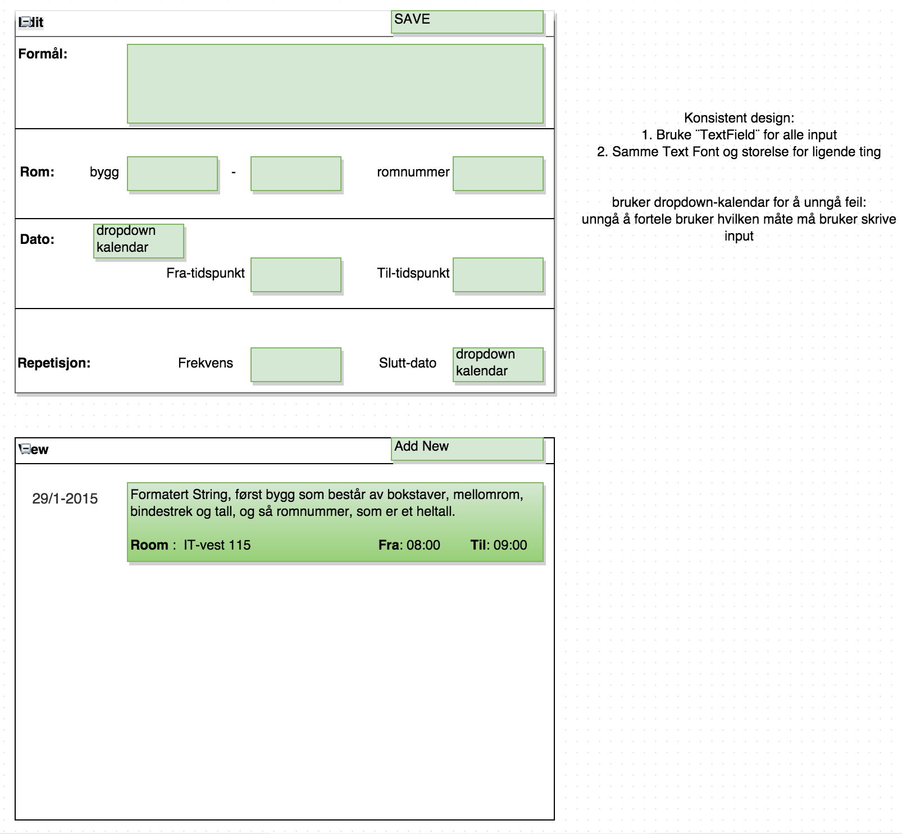
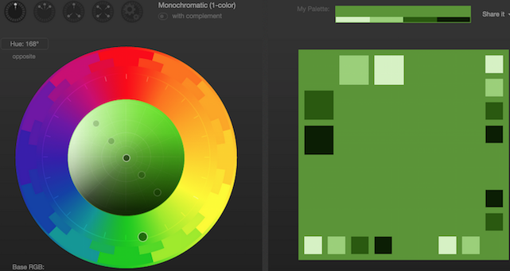
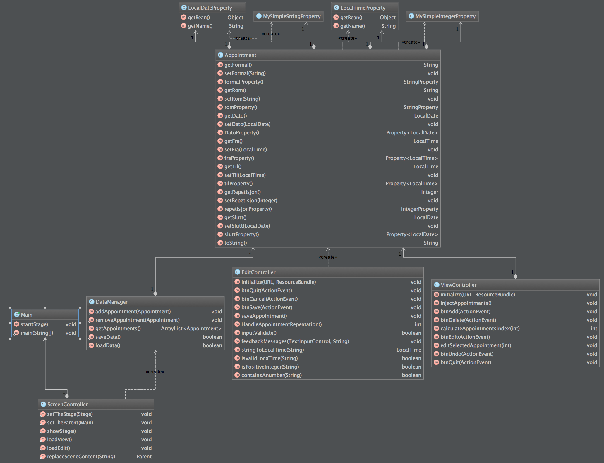

Green Appointment
==

Building tools:

JavaFX, FXML, CSS and JavaFX Scene Builder

IDE:

IntelliJ

[Download application: GreenAppointment.jar](http://junjunguo.com/data/greenAppointment/GreenAppointment.jar)

Screenshot
--

green theme design.

fade in and out animate validation messages!
- attract attentions for the invalid inputs.

validate messages shows at the wrong input place!
- easy to find out and edit the input error.
- show input format if the format is not right

drop-down calendar
- avoid input errors.

Simple repeat method

consistent menu, color, font color, font size and font family design

Simple event overview

consistent hover over design

design Prototype
--

Other Information
--
use [Paletton Color Scheme Designer](http://paletton.com/#uid=12D0u0kllll6mNydQtLsQcVHZ4v)

- to design colors.

Class Diagram:

