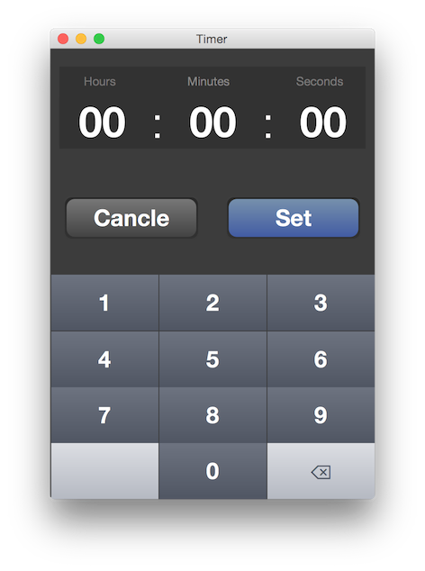
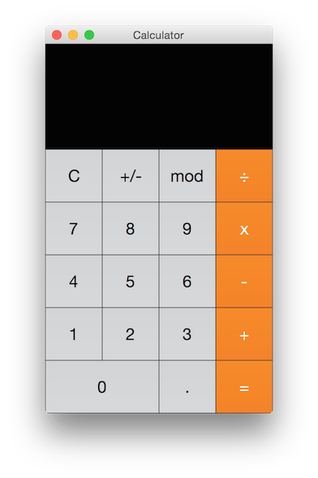
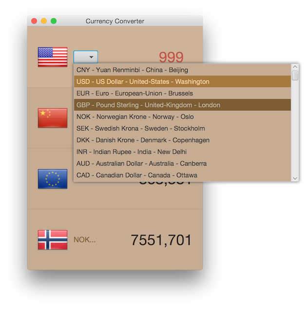

Human-computer interaction
==========================

- Human–computer interaction (HCI) 

- (Menneske-Maskin-Interaksjon MMI)

[Designprinsipper og guidelines](designPrinciples.md)
--

[Calendar](CalendarProgram/)
--

[Green Appointment](GreenAppointment/)
--

[Timer](timer/)
--

[Calculator](Calculator/)
--

[Currency Converter](currencyConverter/)
--

