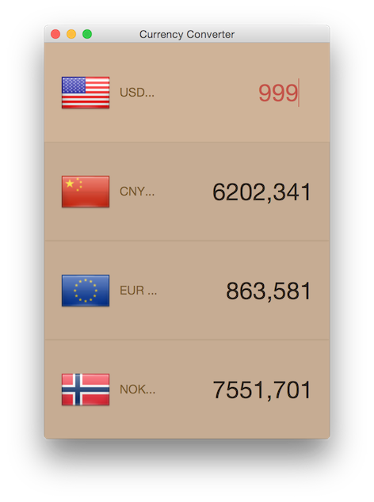
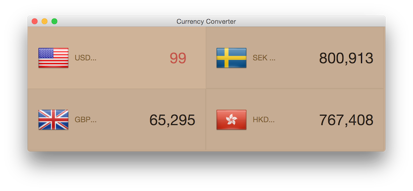
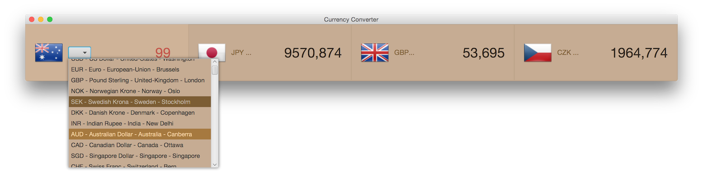

Currency Converter
==

Building tools:
- JavaFX & and CSS were used, no FXML or "JavaFX Scene Builder" used.

Exchange Rate:
- Use online exchange rate [Rate Exchange JSON API](http://rate-exchange.appspot.com/)

Contains:
- More than two hundred countries

Reaction:
- fast and live response when countries are selected.

[Download application: currencyConverter.jar](http://junjunguo.com/data/currencyConverter/currencyConverter.jar)

User Interface:
--

Clean user interface:

Drop-down menu:

Flow pane to fit the screen:

one line view:

