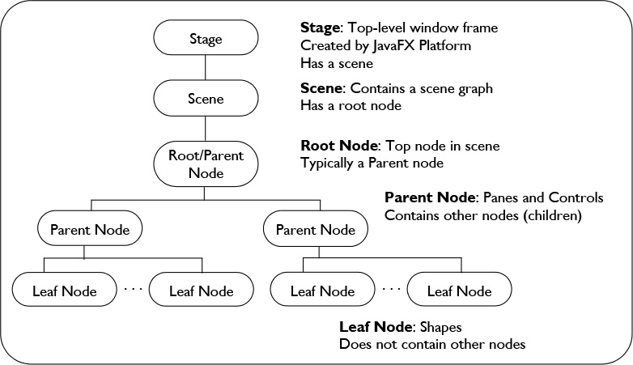

JavaFX
==


```java

package Calculator;

import javafx.application.Application;
import javafx.fxml.FXMLLoader;
import javafx.scene.Parent;
import javafx.scene.Scene;
import javafx.stage.Stage;

public class Main extends Application {

    @Override
    public void start(Stage primaryStage) throws Exception {
        Parent root = FXMLLoader.load(getClass().getResource("calculator.fxml"));
        primaryStage.setTitle("Calculator");
        Scene scene = new Scene(root, 280, 455); // (70*65) : 4*7
        scene.getStylesheets().add("Calculator/calculator.css");
        primaryStage.setScene(scene);
        primaryStage.show();
    }

    public static void main(String[] args) {
        launch(args);
    }
}

```

###Stage
The JavaFX Stage class is the top level JavaFX container. The primary Stage is constructed by the platform. Additional Stage objects may be constructed by the application.
Stage objects must be constructed and modified on the JavaFX Application Thread.

###Scene
The JavaFX Scene class is the container for all content in a scene graph. The background of the scene is filled as specified by the fill property.

###Parent
- The base class for all nodes that have children in the scene graph.
- This class handles all hierarchical scene graph operations, including adding/removing child nodes, marking branches dirty for layout and rendering, picking, bounds calculations, and executing the layout pass on each pulse.
- There are two direct concrete Parent subclasses
	- Group effects and transforms to be applied to a collection of child nodes.
	- javafx.scene.layout.Region class for nodes that can be styled with CSS and layout children.



###JavaFX -- API struktur
- javafx.scene – generelle klasser
	- Scene, Group
- javafx.geometry
	- Point2D, Dimension2D, Bounds/BoundingBox
- javafx.scene.shape – primitiver og figurer
	- Line, Rectangle, Ellipse, Arv, Polygon, Path
- javafx.scene.text – tekst-relaterte klasser
	- Text, Font
- javafx.scene.control – interaktive komponenter
- javafx.scene.layout – container-klasser m/layout
	- Region, Pane, BorderPane, AnchorPane, GridPane, ...


###JavaFX properties
- properties er observerbare egenskaper som kan leses, settes og lyttes på
	- leses med getXXX og settes med setXXX
- property-objekter pakker inn verdier
	- innpakningen kan lese med xxxProperty
	- støtter observerbarhet med
		- add/removeChangeListener(ChangeListener)
###FXML
- FXML is a declarative XML-based language created by Oracle Corporation for defining the user interface of a JavaFX 2.0 application.

- FXML is an XML-based language that provides the structure for building a user interface separate from the application logic of your code.

- FXML lastes inn og oversettes til scene graph vha. en FXMLLoader:

```java
@Override
public void start(Stage primaryStage) throws IOException {
   FXMLLoader fxmlLoader = new FXMLLoader();
   Parent root = (Parent) fxmlLoader.load(this.getClass().getResourceAsStream("Example.fxml"));
   primaryStage.setScene(new Scene(root));
   primaryStage.show();
}
```


####MVC
- From a Model View Controller (MVC) perspective, 
	- the FXML file that contains the description of the user interface is the **view**. 
	- The **controller** is a Java class, optionally implementing the Initializable class, which is declared as the controller for the FXML file. 
	- The **model** consists of domain objects, defined on the Java side, that you connect to the view through the controller.

