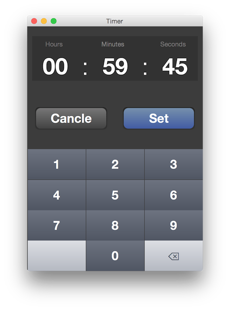

Timer
==
Building tools:
- JavaFX, FXML,  CSS and JavaFX Scene Builder
 
IDE:
 - IntelliJ

[Download application: timer.jar](http://junjunguo.com/data/timer/timer.jar)
 
User Interface:
--
 
- Mobile like

- Support both computer keyboard and mouse click input

Notes:
- Controller implements Initializble
    - initialize runs after root elements are processed.
- TimeLine
    - getStatus.toString() : PAUSED, RUNNING, STOPPED
- focusedProperty():
    - addListener : listen if is focused (actived)
